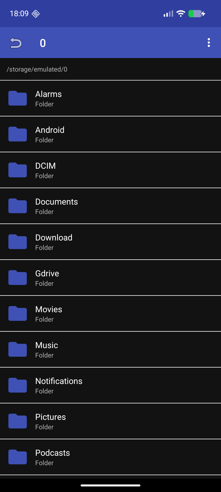

[](https://www.buymeacoffee.com/adegard)

# FileManager

A lightweight, open-source Android file manager. Browse your device's storage, preview text and images, extract ZIP archives, install APKs, and more — all in a simple, fast app.


## Features

- 📁 Browse the full filesystem (all-files access on Android 11+)
- 🖼️ Image preview with **swipe left/right** to navigate, rotate, and share
- 📝 **Edit & save** text files (TXT, PY, JSON, JS, config, etc.) plus DOCX viewing
- 📦 **ZIP / APK / EPUB** extraction with path-traversal protection
- 📲 **Install APK** with robust unknown-source permission handling
- 👁️ Auto **grid view with large thumbnails** for image-heavy folders
- 🔍 Sort by name or date
- 💾 Storage & RAM usage check
- ✏️ Rename / delete files and folders
- 📋 File **properties** dialog (path, size, type, modified date)
- 🌓 Dark-mode aware colors

## Screenshots



## What's included

| File | Purpose |
|------|---------|
| `app/src/main/java/com/degard/filemanager/MainActivity.kt` | File browser, actions, APK install, storage dialog |
| `app/src/main/java/com/degard/filemanager/ArchiveExtractor.kt` | ZIP extraction (Apache Commons Compress) |
| `app/src/main/java/com/degard/filemanager/PreviewActivity.kt` | Image viewer (swipe/rotate/share) & text preview |
| `app/src/main/java/com/degard/filemanager/FileAdapter.kt` | List & grid adapters, threaded image thumbnails |

## Building

Requires:
- Android SDK 34 (`compileSdk = 34`)
- Java 17
- Kotlin 1.9.24 / AGP 8.5.0 (Gradle wrapper 8.7)

```bash
./gradlew assembleRelease
```

The signed release APK is written to:

```
app/build/outputs/apk/release/app-release.apk
```

> Note: the release build is signed with the debug keystore for easy sideloading.

## Permissions

- `MANAGE_EXTERNAL_STORAGE` – browse the whole device (Android 11+)
- `READ/` WRITE `_EXTERNAL_STORAGE` – older Android versions
- `READ_MEDIA_IMAGES` – Android 13+ image access
- `REQUEST_INSTALL_PACKAGES` – install APKs from unknown sources

## Installation

1. Allow **Install unknown apps** for the app you use to distribute it (e.g. a file manager or browser).
2. Copy the APK to your device and open it.
3. Follow the on-screen prompt to allow FileManager to install apps from unknown sources (Settings → the app's "Install unknown apps" toggle, opened automatically).

## License

[Apache License 2.0](LICENSE)
